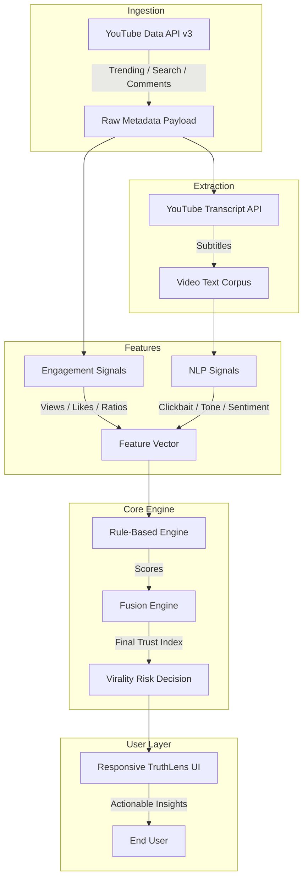

# TruthLens AI Architecture Blueprint
**Prepared for:** Unisys Project Submission
**Version:** 1.0

---

## 📊 System Architecture Diagram

---

## 🚀 Phase-by-Phase Roadmap

### Phase 1: Data & Basic Logic (Current)
* Integration of YouTube Data API v3.
* Real-time fetching of views, likes, comments.
* Execution of the basic Trust Index / Clickbait detection algorithms.

### Phase 2: NLP Content Extraction
* Integration with the `youtube-transcript-api`.
* Text mining for truth-manipulation cues.

### Phase 3: Virality Prediction Models
* Moving beyond static rules into classification pipelines.

---

## 🧠 Phase 1 Fusion Formula

The Trust Index operates on a scale of 0–100. It evaluates:
$$ \text{Trust Index} = \max(0, 100 - (\text{Clickbait\_Score} \times 10 + \text{Engagement\_Risk} \times 10 + \text{Comment\_Risk} \times 10)) $$

* **High Risk (Score < 50)**
* **Medium Risk (Score 50–75)**
* **Safe / Low Risk (Score > 75)**
